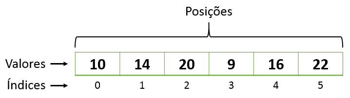

# Repositório: JavaScript_Arrays
O que são e como trabalhar com Arrays no JavaScript

## O que são Arrays na programação
Um array é uma estrutura de dados que segue uma sequência não ordenada, onde os elementos ficam armazenados em uma posição isolada e o acesso é realizado à partir de índices para cada posição de cada item e que são gerados automáticamente na inclusão de cada elemento no array.  
Eles são utilizados para armazenar uma lista de elementos dentro deles e esses elementos podem ser de quaisquer formato e ou tipo.  

. 

Dessa forma você pode armazenar muitos valores refenciados com um único nome de variável e acessa-los através do seu índice. 😉

## Criando Arrays no JavaScript
Você [cria uma variável normal em JavaScript](https://github.com/Atanes-Trybe/JavaScript_Variaveis) e na atribuição dos valores coloca os valores dentro de colchetes separados por virgula, exemplo:

```javascript
  let estados = ['São Paulo', 'Rio de Janeiro', 'Minas Gerais', 'Santa Catarina'];
  let numerosPares = [2, 4, 6, 8, 10];
```
## Acessando e modificando os elementos de um Array
Para acessar o valor de um elemento de um array só precisamos utilizar o índice da posição do elemento, exemplo:

```javascript
  let nomesPessoasEstudantes = ['Alexandre', 'Adriana', 'Michelle', 'Teresa', 'Cláudio'];
  console.log(nomesPessoasEstudantes[2])
  // A saída desse comando seria Michelle, pois é o valor que está no indice 2 do array nomesPessoasEstudantes.
  
  let numeros = [13, 6, 87, 10, 1, 5];
  let soma = numeros[0] + numeros[4];
  console.log(soma)
  // A saída desse comando seria 14, pois estamos somando o valor que está no indice 0 do array de numeros, que é o número 13, com o valor
  // que está na posição 4 do array de numeros que é o número 1.
```

Para modificar o valor de um elemento especifico do um array, também vamos utilizar seu índice no momento de fazer uma nova atribuição, exemplo:

```javascript
  let nomesPessoasEstudantes = ['Alexandre', 'Adriana', 'Michelle', 'Teresa', 'Cláudio'];
  nomesPessoasEstudantes[0] = 'Carol';
  console.log(nomesPessoasEstudantes[0])
  // A saída desse comando seria Carol, pois esse é o novo valor para o indice 0 do array nomesPessoasEstudantes após a atribuição do novo valor 
  // que fizemos com o comando nomesPessoasEstudantes[0] = 'Carol';.
  
  let numeros = [13, 6, 87, 10, 1, 5];
  numeros[4] = 7;
  let soma = numeros[0] + numeros[4];
  console.log(soma)
  // A saída desse comando seria 20, pois estamos somando o valor que está no indice 0 do array de numeros, que é o número 13, com o novo valor
  // da posição 4 do array de numeros que é o número 7 após a atribuição do novo valor que fizemos com o comando numeros[4] = 7;.
```
Para acessar todos os elementos do array ao mesmo tempo utilizamos o nome da variável que usamos para criar o array, exemplo:
```javascript
  let nomesPessoasEstudantes = ['Alexandre', 'Adriana', 'Michelle', 'Teresa', 'Cláudio'];
  console.log(nomesPessoasEstudantes)
  // A saída desse comando seria ['Alexandre', 'Adriana', 'Michelle', 'Teresa', 'Cláudio'].
  
  let numeros = [13, 6, 87, 10, 1, 5];
  console.log(numeros)
  // A saída desse comando seria [13, 6, 87, 10, 1, 5].
```
## Proriedades e Métodos de Arrays em JavaScript

### A Propriedade length

A propriedade length de um Array retorna o tamanho de um Array (o número de elementos do Array).
```javascript
  let numeros = [13, 6, 87, 10, 1, 5];
  console.log(numeros.length);
  // A saída desse comando é 6, pois o array numeros tem 6 elementos armazenados dentro dele.
  
  // Para acessar o valor do primeiro elemento do array podemos usar o indice 0 e para acessar o valor do ultimo elemento do array
  // podemos usar o indice array.length - 1.
  console.log(numeros[0]);
  console.log(numeros[numeros.length - 1]);
```

### Método para adicionar um novo elemento ao array

Para adicionar um novo elemento **no final** do array podemos utilizar o método `push()`, exemplo:
```javascript
  let nomesPessoasEstudantes = ['Alexandre', 'Adriana', 'Michelle', 'Teresa', 'Cláudio'];
  nomesPessoasEstudantes.push('Rodolfo');
  console.log(nomesPessoasEstudantes)
  // A saída desse comando é ['Alexandre', 'Adriana', 'Michelle', 'Teresa', 'Cláudio','Rodolfo'] com o novo elemento adicionado no final do array
```

Para adicionar um novo elemento no início do array e "deslocar" os elementos mais antigos podemos usar o método `unshift()`, exemplo.  
```javascript
  let nomesPessoasEstudantes = ['Alexandre', 'Adriana', 'Michelle', 'Teresa', 'Cláudio'];
  nomesPessoasEstudantes.unshift('Rodolfo');
  console.log(nomesPessoasEstudantes)
  // A saída desse comando é ['Rodolfo','Alexandre', 'Adriana', 'Michelle', 'Teresa', 'Cláudio'] com o novo elemento adicionado no início do array.
```

### Método para remover um elemento do array

Para remover **o ultimo** elemento de um array podemos utilizar o método `pop()`:
```javascript
  let frutas = ["Banana", "Laranja", "Maça", "Manga", "Abacate"];
  frutas.pop();
  console.log(frutas)
  // A saída desse comando é ["Banana", "Laranja", "Maça", "Manga"] com o ultimo elemento (Abacate) removido do array
```

Os elementos do array também podem ser excluídos usando o operador JavaScript `delete`, mas nesse caso deixamos a posição do elemento no array com um undefined como valor.

```javascript
  let frutas = ["Banana", "Laranja", "Maça", "Manga", "Abacate"];
  delete frutas[0];
  console.log(frutas)
  // A saída desse comando é [undefined, "Laranja", "Maça", "Manga", "Abacate"] com o undefined no lugar de Banana.
```
### Método para adicionar e remover elementos em um array
Temos um método que pode ser utilizado para adicionar um novo elemento ao array ou para fazer a remoção de um elemento do array, esse método é o `splice()`. 👏🏻

Exemplos:

**Adicionar elementos**
```javascript
  let frutas = ["Banana", "Laranja", "Maça", "Manga", "Abacate"];
  frutas.splice(3,0,'Uva','Morango');
  console.log(frutas)
  // A saída desse comando é ["Banana", "Laranja", "Maça", "Uva", "Morango", "Manga", "Abacate"] com a inclusão de Uva e Morango depois da terceira posição do array.
```
O primeiro parâmetro (3) define a posição onde novos elementos devem ser adicionados (spliced ​​in).

O segundo parâmetro (0) define quantos elementos devem ser removidos .

O resto dos parâmetros ('Uva','Morango') definem os novos elementos a serem adicionados .


**Remover elementos**
```javascript
  let frutas = ["Banana", "Laranja", "Maça", "Manga", "Abacate"];
  frutas.splice(2,2);
  console.log(frutas)
  // A saída desse comando é ["Banana", "Laranja", "Abacate"] com a exclusao de Maça e Manga, os dois elementos a partir da posição 2 do array.
```
O primeiro parâmetro (2) define a posição onde novos elementos devem ser adicionados (spliced ​​in).

O segundo parâmetro (2) define quantos elementos devem ser removidos .

Os demais parâmetros são omitidos. Nenhum novo elemento será adicionado.

### Método para converter o array em uma string

Podemos usar  método `toString()` para converter um array em uma string com os valores dos seus elementos separados por vírgula.
```javascript
  let frutas = ["Banana", "Laranja", "Maça", "Manga", "Abacate"];
  console.log(frutas.toString())
  // A saída desse comando é Banana,Laranja,Maça,Manga,Abacate.
```

Também podemos usar o método `join()` para converter um array em uma string, a diferença é que nesse método podemos especificar qual separador queremos usar.
```javascript
  let frutas = ["Banana", "Laranja", "Maça", "Manga", "Abacate"];
  console.log(frutas.join(" - "))
  // A saída desse comando é Banana - Laranja - Maça - Manga - Abacate.
```

### Método para copiar parte do array
Se quisermos fazer uma cópia do array, ou parte dele, podemos usar o método slice() que retorna uma cópia do array a partir de um subarray criado entre as posições início e fim (fim não é necessário) do array original, sendo que o Array original não é modificado nesse processo e o resultado final é um **novo** array.
```javascript
  // Exemplo para extrair 'Laranja' e 'Limao' do array frutas
  let frutas = ['Banana', 'Morango', 'Amora', 'Laranja', 'Limao', 'Maçã', 'Manga'];
  let frutasVermelhas = frutas.slice(1, 3);
  console.log(frutasVermelhas);
  // A saída desse somando seria ['Morango', 'Amora'] que é o conteúdo do novo array frutasVermelas
```

### Método para inverter a ordem do array
Quando queremos inverter a ordem de um array podemos usar o método `reverse()`, exemplo.
```javascript
  let frutas = ["Banana", "Laranja", "Maça", "Manga", "Abacate"];
  console.log(frutas.reverse())
  // A saída desse comando é ["Abacate", "Manga", "Maça", "Laranja", "Banana"].
```

### Iterando (caminhando) sobre os elementos do array
Existem várias formas de iterar (caminhar) sobre os elementos de um array, a forma mais simples e direta é usando um laço de repetição e vamos ver dois exemplos 
usando o `for` (tradicional e for of).

Com o `for` tradicional podemos caminhar pelos elementos do array usando uma variável de controle para os indices do array, exemplo:
```javascript
  let frutas = ['Banana', 'Morango', 'Amora', 'Laranja', 'Limao', 'Maçã', 'Manga'];
  for (let index = 0; index < frutas.length; index += 1){
      console.log('Fruta: ', frutas[index]);
  }

// Usando a variável index para referenciar cada indice do array e fazendo o controle dessa variável até o tamanho do array e com passo de 1 em 1, a 
// saída desse comando é:
// Fruta:  Banana
// Fruta:  Morango
// Fruta:  Amora
// Fruta:  Laranja
// Fruta:  Limao
// Fruta:  Maçã
// Fruta:  Manga
```

Outra forma de iterar de forma simples e direta sobre os valores do array é usando o `for of` onde cada elemento é referenciado por uma variável criado 
no laço de repetição e que faz a iteração do primeiro ao ultimo elemento do array de forma sequencial.

```javascript
  let frutas = ['Banana', 'Morango', 'Amora', 'Laranja', 'Limao', 'Maçã', 'Manga'];
  for (fruta of frutas){
      console.log('Fruta: ', fruta);
  }

// A estrutura desse laço for é bem mais simples e o resultado é o mesmo do for tradicional:
// Fruta:  Banana
// Fruta:  Morango
// Fruta:  Amora
// Fruta:  Laranja
// Fruta:  Limao
// Fruta:  Maçã
// Fruta:  Manga
```

Mais informações sobre Arrays no JavaScript você pode consultar o [W3Schools](https://www.w3schools.com/js/js_arrays.asp) ou o [MDN Web Docs community](
https://developer.mozilla.org/pt-BR/docs/Web/JavaScript/Reference/Global_Objects/Array)
